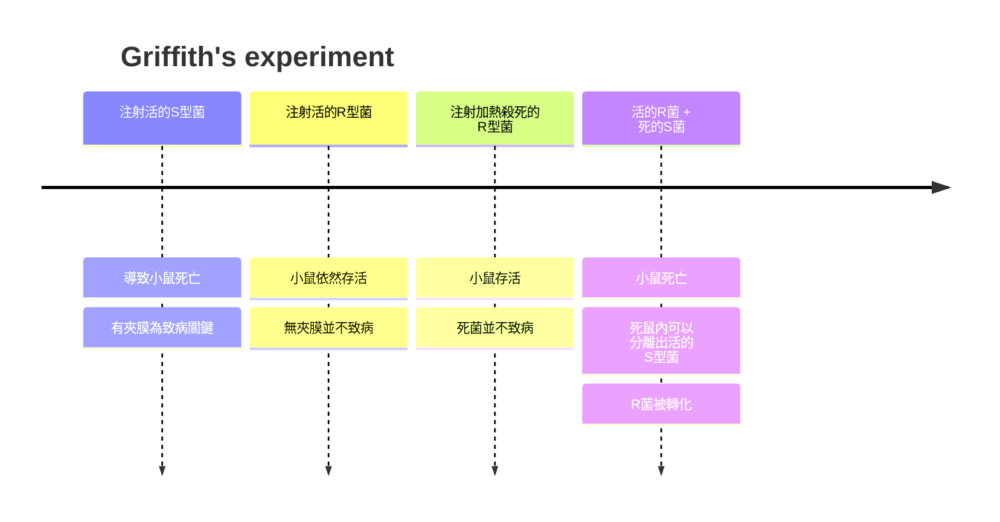
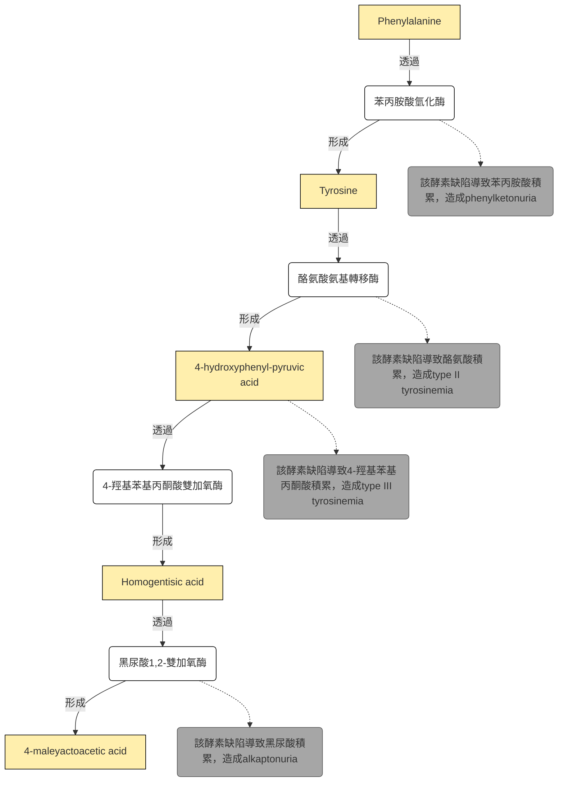
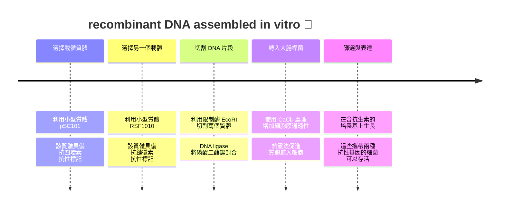
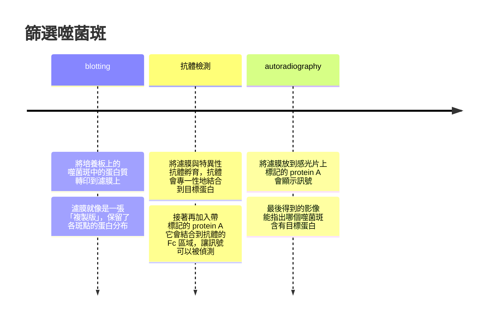

# molecular biology 1st
## chapter 1 and 2
### before we start the class...
> 大家還記得嗎? 😏
#### Mendel 🫛
- **Mendel並不知道gene的存在**，只是認為父母會給後代一些他也不知道的... 東西
- genotype = 基因型，phenotype = 表現型
- dominant = 顯性，recessive = 隱性，由於Mendel運氣好選到了完全顯性的物種性狀，因此才能夠提出分配律和獨立分離律
- 子代之所以用 $F$ 是因為拉丁文的*filius*是兒子，*filia*是女兒
- 他認為個體身上有兩個東西，每一次會各傳一個給自己的 $F$ ，homozygotes = 同型合子，heterozygotes = 異型合子
- 性狀會呈現出dominant allele的表現型，而且這些allele並不會消失，而是傳給下一代

#### Morgan 🪰
- chromosome theory of inheritance: 染色體是基因的載體
- 他把白眼 (recessive) 和紅眼 (dominant) 果蠅雜交，發現大部分 (但不是全部) 的第一子代是紅眼
- 然後第一代雄果蠅和第二代雌果蠅 (都是紅眼) 雜交，產生四分之一的白眼雄果蠅，沒有雌果蠅是白眼

> [!Tip]
> 這叫做sex-linked (性聯遺傳)，也是這時才把染色體分成autosome (體染色體) 和 sex chromosome (性染色體) 🐱

- wild type = standard type = 一般種，mutant = 突變種
- 白眼和短翅 (miniature) 都是mutant，也是X染色體性聯遺傳

##### 互換率
- 在雙雜合測交 (test cross) 或雜交實驗中，後代會分成親本型 (parental type) 和重組型 (recombinant type)
  - 親本型: 基因組合與親代相同
  - 重組型: 因為互換而出現的新組合

$$
\text{互換率} = \frac{\text{重組型個體數}}{\text{總個體數}} \times 100\%
$$

- 在基因圖譜中，常用分摩根 (centimorgan, cM)，**1% 的互換率 ≈ 1 cM**
- **互換率最高只能到 50%**，因為當基因座距離太遠時，互換幾乎隨機，和獨立分配無法區分
- **互換率與基因座距離大致成正比**，但在長距離上會低估 (因為可能有多次交叉互相抵消)

#### RNA類型


| RNA 種類 | 功能 | 負責的 RNA pol | 備註 |
| --- | --- | --- | --- |
| **mRNA** | 攜帶基因資訊，作為蛋白質合成模板 | **RNA pol II** | 轉錄大部分的 snRNA、miRNA 等 |
| **tRNA** | 將胺基酸帶到核糖體，對應 mRNA 密碼子 | **RNA pol III** | 同時也轉錄 5S rRNA 與一些小 RNA |
| **rRNA** | 構成核糖體的主要結構與催化成分 | **RNA pol I** | 專門轉錄 28S、18S、5.8S rRNA |


### 分子遺傳學
#### Griffith's experiment
- 發現了轉化原理，**transformation particle**
- 他使用 *Streptococcus pneumoniae*，分為有多醣莢膜的致病型 (S 型，smooth) 和無莢膜的非致病型 (R 型，Rough，很快就被白血球吞掉)

> [!Note]
> - **virulent**: 致命
> - **avirulent**: 不致命




#### Avery's experiment
- 雖然Griffith已經知道有一種東西可以把無害的細菌變成有害，但他不知道是啥物質
- 他一樣使用 *Streptococcus pneumoniae*，然後從S型細菌中提取未知的轉化物質
- 這些雜物分別用蛋白酶、RNA酶、DNA酶處理後，給R型菌

||觀察到|
|---|---|
|蛋白酶|R 型被轉化成 S 型|
|RNA酶|R 型被轉化成 S 型|
|DNA酶|R 型無法被轉化|

- 由於**唯有破壞 DNA 時，轉化作用消失**，這證明 DNA 就是遺傳物質，而不是蛋白質或 RNA


- 至於如何分離並確定是DNA，有一些方式...
  - 超快速離心 (Ultracentrifugation，很中二的名字)，因為DNA分子量很大
  - 電泳 (Electrophoresis)，因為他有很大的**charge-to-mass ratio**，跑很遠
  - 紫外光 (Ultraviolet)，在**260nm**有最大吸收峰 (不同於蛋白質的280nm)
  - 氮磷比 (N-to-P ratio)，通常DNA的磷很多，**如果高於1.67，代表可能還不夠純**

#### Beadle's experiment
- 他和Edward Tatum，例用麵包黴 (*Neurospora crassa*) 做實驗
- 一般來說麵包黴能在簡單培養基（只含糖、鹽、維生素）中生長，這代表它能自己合成所有必需胺基酸與維生素
- Beadle 與 Tatum 用 X 光 (mutagents) 照射孢子，製造隨機突變，然後讓他們在這些培養基中生長

> [!Tip]
> 若某突變株無法在最小培養基生長，但在加入特定胺基酸或維生素後能恢復生長，表示該突變破壞了合成該分子的基因 ! 😗

- 因此他們認為，每個基因控制一個特定酵素的合成，也就是**一基因一酵素假說**
- 但後來發現...
  - 一個酵素可以由多個基因形成
  - 很多基因並不編碼酵素，例如遺傳因子的基因
  - 有些基因甚至編碼RNA，而非蛋白質
  - 原核生物通常是一基因一多肽，但是真核生物有些可以做 "可變基因剪切"

> [!Important]
> ##### 必記 😏
> - 現在已經基本有共識，**即使你編碼的是IncRNA，你也會被認為是 "gene"**，即使你不會產生蛋白質 🐱

#### Hershey–Chase experiment
- 利用phage T2，蛋白質外殼 + DNA核心
- 用 $^{35}S$ 標記蛋白質 (Cys and Met有S)， $^{32}P$ 標記DNA (磷酸基團)
- phage感染大腸桿菌後，把嗜菌體外殼甩掉
  - 如果是phage外殼被S標記，在離心後會在懸浮液裡面發現放射標記
  - 如果是phage DNA被P標記，在離心後會在沉澱pellet中發現放射標記 
- 因為pellet裡面是大腸桿菌，而在標記P的時候，才在pellet裡面發現標記，因此注入E.coli的東西，就是含有P的DNA


#### Meselson–Stahl experiment
- 他們用氮同位素 $^{15}N$ 培養E.coli，使其DNA全部含有重氮
- 然後轉移到只含 $^{14}N$ 的培養基，讓他們一代一代分裂
- 每一次複製後取出DNA，利用 $CsCl$ 做密度梯度離心 

|generation|result|
|---|---|
|第0代|只有重帶DNA|
|第1代|出現中間帶DNA|
|第2代|出現中間帶DNA和輕帶DNA|

- 這證明了半保留複製 **(semiconservative replication)**


### 聚核甘酸
- DNA的組成 = **含氮鹼基 + 磷酸基 + 去氧核醣**
- purine兩環，pyrimidine一環
- **核糖在2C上有OH**，去氧核糖沒有
- nucleosides為**核甘酸 - 磷酸基**
- 含氮鹼基連在1C，2C看是OH還是H，3C接磷酸二酯鍵 (phosphodiester bonds)，5C接磷酸基
- 起頭為5'-phosphate group，尾巴為3'-hydroxyl group

> [!Tip]
> 因為中間的鍵結是中間一個P，兩邊接O，所以叫做phospho + di + ester，如下: 
> ```
> Sugar₁ — O — P(=O)(O⁻) — O — Sugar₂
>          ↑               ↑
>        ester           ester
> ```


#### 反應機構
##### 定位
- DNA 聚合酶將 dNTP $\alpha$ -磷酸靠近引子 3'-OH
- $Mg^{2+}$ 雙金屬離子協助穩定負電荷

##### 親核攻擊
- 3'-OH 的氧原子進攻 $\alpha$ -磷酸的磷原子 (路易士鹼攻擊P)
- 形成一個五配位過渡態 (pentavalent transition state)

##### 鍵形成
- 新的磷酸二酯鍵在 3'-O 與 $\alpha$ -磷酸之間形成
- DNA 鏈延長一個核苷酸


#### Chargaff's rules and double helix
- 嘌呤的數量大致和嘧啶差不多，$N_A = N_T,\ N_C = N_G$
- 富蘭克林等人製備一種濃度很高的DNA溶液，並且用針頭拉出一根纖維
- X射線繞射圖之所以很重要，就是因為呈現出來的圖型很簡單: 一系列呈現X型排列的斑點
- 如果是一般的蛋白質做繞射，這些斑點會像是亂槍掃射一樣隨便
> [!Important] 
> DNA如果分子量和蛋白質一樣很大，那唯一的解釋就是: 這個大分子有規則的重複結構 !! 🧐

- 唯一的悖論就是: 你說DNA是重複的規則，但是如果他有編碼蛋白質，那他的序列應該是不規則的啊
- 因此華克兩人提出一個解決矛盾的方法: 兩條DNA並排，並且嘌呤一定會和嘧啶配對 (寬度固定)
- 因此DNA的結構特色就是: 
   - 一圈大約十個鹼基對，一圈往上升高 $3.32nm$
   - 反平行，3'到5'，另一股就是5'到3'
   - 嘌呤和嘧啶之間氫鍵配對

### 核酸的特性
#### helix
- DNA有不同構相: A、B、Z
- B form是多數DNA的標準型，而**A form很常出現在雙股RNA或是DNA-RNA的雜合核酸**

|DNA型態|B-form|A-form|z-form|
|------|----|---|---|
|旋性|右手螺旋|右手螺旋|左手螺旋|
|一圈多少鹼基對|10.4 bp/turn|11 bp/turn|12 bp/turn|
|一圈有多高|3.4 nm/turn|2.4nm nm/form|4.5 nm/form|
|groove|明顯的 major and minor|有major and minor，但不明顯|只有一個groove|
|直徑|1.9 nm|2.3 nm (較寬)|1.8 nm (較扁)|
|屬於|標準型，predominant form，相對溼度約92%，鹼基和中心軸幾乎垂直|脫水型，鹼基相對於中心軸傾斜20度，結構較緊湊，相對溼度下降到75%|形成zig-zag的型態，通常出現在GCGCGC等重複序列裡面|


#### denature
- 雖然說嘌呤和嘧啶的量相似，但是**GC content**在各個生物中不一定一樣，從22%到73%都有，而這些差異會影響DNA的物理性質
- DNA加熱時會使中間氫鍵斷裂，形成兩條單股DNA，這又稱為denaturation
> [!Important]
> $T_m$ = DNA在denature一半時的環境溫度 🐱


- 在雙股 DNA 中，嘌呤與嘧啶鹼基彼此平行排列，形成 $\pi - \pi$ 堆疊。這種堆疊會限制電子的激發，降低紫外光 (最高吸收峰在 $260 nm$ ) 的吸收，產生 **"減色效應"**
- 當DNA加熱分開，H-bond消失，堆疊消失，吸收光的能力增加


- 偕同轉換: DNA denaturing並不是一個一個氫鍵斷裂，而是 "區塊脫落" (因為某一區域的氫鍵斷裂，會使鄰近區域更容易斷裂)
- 因此， $260nm$ 吸光度曲線會 "急遽上升"，呈現S型
- Tm值會隨著 $\frac{G+C}{A+T}$ 的比值升高而升高。所以越多GC，也就是GC content越高，DNA越穩定， $T_m$ 越高，因為氫鍵比較多，DNA比較難分開

#### 補充
- 加熱並非打開雙股的唯一方法，用dimethyl sulfoxide或是formamide (有機溶劑)，以及鹼性環境，都可以破壞氫鍵
- 降低環境鹽分也可以，因為沒有多餘的帶電粒子，兩條鏈上的負電荷就不太會被屏蔽，使DNA不用加熱太高溫就能夠分開
- DNA2的GC content也會影響DNA的密度，通常來說，GC content越高，密度越大，在用 $CsCl$ 做梯度的離心時就可以看出來

#### renature
- renature，或是annealing，就是DNA降溫後重新排列的情況
- 通常來說，會比 $T_m$ 低25度當renature的溫度，如果太高溫，那很有可能繼續分開，但是如果太低溫，單股分子移動速度變慢，又找不到彼此
> [!Tip]
> **quenching** = 把熱的DNA溶液插到碎冰裡面讓他們維持單股狀態 😗

- 除此之外，DNA溶液濃度越高，以及配對時間越長，renature的比例也會越高

#### hybrid
- 如果是ssDNA + ssRNA的結合，那不叫做renature，而是叫做**hybridization**

#### 大小測量
- DNA的大約分子量可以用長度轉換成鹼基對，鹼基對轉換成分子量，也就是說: 

$$
\begin{align}
N(\text{鹼基對}) & = \text{觀察長度}\times\frac{10.4\ \mathrm{\mathring{A}}}{33.2}\\
N(\text{分子量}) &= N(\text{鹼基對})\times 660
\end{align}
$$

- 因為一個鹼基對的平均分子量約為660
##### Metal shadowing
- DNA 是非常細的分子，非常接近電子顯微鏡的解析度極限，因此會用金屬鍍膜
- 概念就是... 
  - 將 DNA 分子鋪在薄膜上，再用重金屬 (如鉑、鈾、鎳) 噴霧撒他 (下雪的概念?)
  - 然後這些金屬沫就會堆積在DNA周圍，使DNA在暗色背景下發亮


- 這樣就有辦法在顯微鏡下估算DNA的長度了。除此之外，也可以用凝膠電泳來估算分子量

#### C-value paradox
- **C-value**就是每個 **"單倍體細胞"** 的基因組大小
- 不同生物的基因組大小差異極大，但這個大小卻**不一定與生物的複雜度相關**
- genome裡面有大量重複序列、轉座子、偽基因等，並不直接編碼蛋白質 (non-coding)
- 同時，複雜度更多來自基因調控網絡，而非基因數量。這種基因組大小跟生物複雜度不對齊的狀態，被稱為**C值悖論**


---

## chapter 3
### 訊息儲存
- 中心法則如下: 


> [!Important] 
> ##### 必記 😏
> - DNA在轉錄時，一個為**template strand (anticoding strand, antisense strand)**，一個是**coding strand (nontemplate strand, sense strand)**

#### 蛋白質結構
- 胺基酸由alpha-C為中心，一邊接 $NH_3^+$ ，一邊接 (COO^-)，一邊接 $H$ ，一邊接**R group**
- 胺基酸脫水後連接，以**peptide bond (你也可以說是amide bond)** 相連，多肽分為N端和C端，沒有氫鍵時就是**primary structure**，有氫鍵做成 $\alpha$ -helix，或是 $\beta$ -sheet 時，就是**secondary structure**，方向為N端到C端


> [!Note]
> $\beta$ -sheet有**平行**和**反平行**兩種形式，他們都存在 😗

- **tertiary structure**包含的鍵結很多樣，可以是**van de waal interaction**，也可以是**H-bond**，也可以是**covalent bond**，也可以是**ionic bond**

> GAMT (guanidinoacetate N-methyltransferase) 是creatine (肌酸) 合成的重要酵素，而肌酸在肌肉、心臟與腦中作為能量緩衝分子，透過磷酸肌酸系統快速再生 ATP，以 $\alpha$ -helix 和 $\beta$ -sheet 混合構成， $\beta$ -sheet呈現平行分布的構造 

<iframe src="https://Jacklyn301.github.io/molecular_model/3ORH_Human%20guanidinoacetate%20N-methyltransferase%20with%20SAH.html" width="100%" height="400px"></iframe>

- 蛋白質有時會分成不同區域，並不一定像是globin一樣成為一坨蛋白質，這又被稱為domain
- 這些domain有時可以看到叫做**motifs**的結構，例如所謂的鋅指就是其中一種

> [!Important]
> 如果你說的是functional domain，那分類方式通常只是有功能的一小塊區域 (相當於motif)，並不是一整個三級結構 ! 😗

- 多數蛋白質並非有了自身序列就會自動摺疊，往往需要酵素以及合適的環境
- 但是蛋白質會因為胺基酸疏水或是親水的特性自動摺疊
- 通常來說，Leu、Val、Ile等疏水胺基酸會聚集在蛋白質中間的地方，避免靠近水

> [!Important]
> - **蛋白質折疊的主力，其實就是hydrophobic force**，水分子強迫把所有疏水的東西放在一起
> - **先確保親水疏水，再進行折疊 !** 😲

#### Garrod's experiment
- Archibald Garrod 在 1902 年首次提出**先天性代謝錯誤 inborn errors of metabolism**
- 他發現疾病 (例如研究**alkaptonuria**) 可以因為基因缺陷導致特定酵素缺失，進而影響代謝途徑
- 當時人們以應知道代謝是酵素參與，而它們發現這些代謝疾病似乎有遺傳傾向，因此開始認為gene和酵素有一定的關係



- 同時，劍橋科學家 William Bateson 指出alkaptonuria符合孟德爾的隱性遺傳模式，並進一步推動**遺傳學 (genetics)** 這一學科的建立
- 這個實驗和Beadle和Tatum等人用麵包黴 (*Neurospora crassa*) 做出來的實驗假設類似

#### 基因分析
- 在基因分析上也做了一樣的事情。身為子囊菌的麵包黴，在形成2n的合子後會在減數分裂和細胞分裂後生成兩個8個子囊孢子
- 如果將突變的麵包黴和wild type 雜交，而同時該疾病是由單一的基因突變引起，那這8顆孢子，應該就有4顆是突變型
- 後來經過更深一步研究，**從 "一酵素一基因" 假說，變成 "一多肽一基因" 假說**
- 因此，蛋白質還可以作為激素、轉錄因子、細胞膜通道等等

### 如何傳遞訊息?
- Crick發現說，DNA位於真核細胞的細胞核中，但是蛋白質往往是在細胞質中合成。所以一定有東西把DNA的訊息傳到了細胞質
- 他當時注意到了rRNA，但是又發現rRNA是核糖體不可分割的一部份，因此他認為: 

> [!Note]
> 一個細胞中有很多不同種核糖體，而rRNA攜帶特定的訊息，反覆合成同一個蛋白質 ! 🫠

#### Jacob's experiment

- 當然，Jacob等人並不買帳，他們想要證明核糖體並不是訊息載體
- 他們先用 $^{15}N$ 和 $^{13}C$ 等較重的同位素培養細菌，讓這些細菌的核糖體逐漸含有這些標記的同位素
- 然後他們用phage感染細菌，並把細菌轉移到新的培養皿中，這些培養皿含有 $^{14}N$ 和 $^{12}C$，這導致接下來產生的任何新的核糖體都含輕同位素
- 同時利用 $^{32}P$ 標記未來產生的嗜菌體RNA。他們假設，如果Crick是正確的，那會發現只有新的核糖體蛋白質，可以和新的RNA形成核糖體

> [!Tip]
> #### 結果...
> - 後來在輕的核糖體上面 (也就是舊的核糖體)，看到了新合成的嗜菌體RNA
> - 也就是說，這些舊的RNA不僅不可能攜帶嗜菌體的遺傳信息，可能也根本不攜帶任何宿主的遺傳訊息
> - **核糖體從頭到尾基本上就是固定的！** 🧐


- 後來發現傳遞訊息的RNA，半衰期很短，並且與蛋白質合成同步
- 同時，這些短壽命 RNA 與 DNA 序列相對應，顯示它們是 **"DNA 的抄本"**，更進一步證明他們不是核糖體的固定成分
- 這後來被稱為**mRNA**

### 轉錄
#### mRNA structure
- 通常長這個樣子: 

$$
\boxed{\text{5'-UTR, leader}}-\boxed{\text{coding region}}-\boxed{\text{3'UTR, trailer}}
$$

- coding region對應到的就是DNA的ORF
- 其中，起始密碼子和終止密碼子都是包含於coding region
#### 過程
- 通常分為三個階段: 起始、延伸、中止

|phase|description|
|---|---|
|**Initiation**|酵素辨識promoter (位於基因上游)，pol會在promoter結合，打開雙股螺旋 (約分開12個bp)，然後用NTP建造 |
|**Elongation**|合成時為**RNA本身的5'到3'方向**，轉錄泡隨著RNA pol移動，轉錄完的上游區域會重新變成雙股螺旋，一次一條RNA，一次只拿一股DNA當模板|
|**Termination**|基因末端往往有terminator，會發出終止訊號，並和RNA pol相互作用，使RNA從DNA和RNA pol分離|

- 通常轉錄開始時，RNA 第一個 nucleotide 常常是ATP或是GTP，RNA的5' 保留pppA或是pppG，因為它是 de novo synthesis，沒有 primer
- 它們辨識到底要從哪裡開始轉錄的方式，就是**透過motif來辨識promoter**

> [!Important]
> ##### Most initiations are abortive
> - RNA polymerase 剛開始其實超廢。它常常：
> ```text
> 做2個核苷酸
> ↓
> 失敗 🧐
>
> 做4個核苷酸
> ↓
> 失敗 🙂
>
> 做7個核苷酸
> ↓
> 失敗 💀
> ```
> - RNA常常做一半就掉出去，重新開始，這叫做**abortive initiation**，產生小 RNA。

- 當做到 8~10 nt的時候，這時候 RNA polymerase開始離開 promoter，開始進入穩定 elongation
- 也就是說，剛開始時通常移動速度不會太快，因為這時候要**確保配對的位置是對的**

### 轉譯
#### ribosome
- E.coli的兩個單元大概是30S和50S (沉降係數，離心時辰降到管底的速度)，兩個形成70S的核糖體
  - **small subunit** = 16S rRNA + 21個蛋白質
  - **large subunit** = 23S rRNA + 5S rRNA + 34個蛋白質
- rRNA生存的唯一目的就是變成核糖體，參與催化功能，並不編碼蛋白質

> [!Warning]
> 沉降係數和顆粒質量不成正比，通常來說，關係大致如下: 
> $$\text{沉降係數}\propto(\text{質量})^{\frac{2}{3}}$$


#### tRNA
- Crick當時想知道到底是什麼東西讓RNA的訊息變成蛋白質的，畢竟還沒甚麼相關的數據和研究
- 他只知道這個分子應該要能辨認RNA，也可以辨認特定的氨基酸。很幸運的是，他的猜測似乎對了 🐱
- tRNA被摺疊成L型三級結構，有兩個功能端，一端就是tRNA的3'，也負責連接胺基酸。另一端是反密碼子區域，可以跟mRNA做互補


<iframe src="https://Jacklyn301.github.io/molecular_model/1EHZ_the%20crystal%20structure%20of%20yeast%20phenylalanine%20tRNA.html" width="100%" height="400px"></iframe>

- 相應的tRNA具體要配對的氨基酸往往是固定的 (不模糊性)，如果該tRNA對應到的氨基酸是alanine，那酵素只能讓alanine何其結合
- 這種酵素通稱為aminoacyl-tRNA synthetase


<iframe src="https://Jacklyn301.github.io/molecular_model/1G59_Glutamyl-tRNA%20synthetase%20complex%20with%20tRNA(Glu).html" width="100%" height="400px"></iframe>


| 特徵     | 解釋  |
| ----| ---- |
| **degeneracy/redundancy**<br>退化性 | 多個密碼子對應同一種胺基酸|
| **unambiguous**<br>不模糊性| 特定一種密碼子只對應一種胺基酸 |
| **universal**<br>廣泛性 | 所有生物共用同一套遺傳密碼，雖然偶有差異 |

#### 轉錄的起始
- translation開頭的codon為AUG
- **Shine-Dalgarno 序列**是細菌 mRNA 上的一段短序列，在AUG上游
- 這些序列不完全是固定的，但是共識序列通常是 `AGGAGG`。它會**和 16S rRNA 的 3′ 端互補配對**

> [!Tip]
> 真核生物沒有Shine-Dalgarno 序列，而是由elF4E蛋白和5'帽結合，吸引核糖體

#### 延伸
- 順序為**A、P、E**
- 起始tRNA在P位點結合，然後延伸的工作在A位點完成
- **peptidyl transferases**負責連接A位點的胺基酸到P位點
- 轉移的過程需要**EF-Tu蛋白和GTP**
- 轉位發生，核糖體往前移一個 codon，**A → P，P → E** 
- tRNA離開核糖體需要**EF-G蛋白和GTP**

|site|description|
|---|---|
|**A 位 (aminoacyl-tRNA)**|新 aminoacyl-tRNA 進入|
|**P 位 (peptidyltRNA)**| 帶有生長中的多肽鏈的 tRNA|
|**E 位 (exit)**|釋放已經卸下胺基酸的 tRNA|


#### 終止
- 當遇到終止密碼子 (UAA, UAG, UGA)，沒有對應的 tRNA
- 釋放因子結合上去，促使多肽鏈釋放
- **RF3** (原核) 會幫助釋放因子離開核糖體，也要靠 **GTP**


#### codon bias
- 生物的tRNA有時候會比較偏好某些密碼子，即使密碼子對應的是同一個胺基酸，因為...
  - 不同的tRNA含量有差，使用對應的tRNA比較多的codon，轉譯比較快
  - 高表達量的基因比較偏好那些轉譯不容易錯誤的密碼子
  - 不同動物有不同的密碼子偏好
- 如果你想要大量製造某一個蛋白質，將密碼子修改成E.coli偏好的，就能夠提升表現

#### ORF
- **ORF (open reading frame)** = DNA從起始密碼子到終止密碼子這一段
- 一般來說，一條mRNA可能ORF會有很多個，畢竟你可能可以在一條序列中找到多個起始密碼子和終止密碼子，例如...

```text
5' ───────────────────────────────────── 3' mRNA
      AUG───────UAA                         可能1
          AUG──────────────UGA              可能2
             AUG───UAG                      可能3
```

- 但是對典型的 eukaryotic mRNA，ribosome 通常會**從 5′ cap 附近開始 scanning**，找到合適的 start codon 後開始翻譯
- 因此，如果有一個主要的、較長的 coding region，它就很可能是主要 protein-coding ORF


### 複製和突變
#### replication
- Crick等人在發表論文時，就已經有預測DNA應該會複製，以將訊息傳給子細胞
- 而它們也預測DNA是透過**semiconservative replication**
- 當然，當時還有其他假設，例如**conservative (全保留)**、**dispersive (分散式)**
- 而透過**Meselson–Stahl experiment**，確定了DNA是半保留複製

#### 無害的突變
- 通常無害的點突變分為兩種: 
   - **silent mutation**: 突變後的codon對應突變前的同一個胺基酸，例如 `AAA` = `AAG` = Lysine (先不考慮codon bias的話 😗)
   - **conservative**: 突變後的codon對應突變前codon的胺基酸性質類似，例如 `CUC` = Leucine，`AUC` = Isoleucine，Leu和Ile皆為hydrophobic，蛋白質摺疊時比較不會出問題

#### sickle cell disease
- 一般人的RBC呈現biconcave disc (雙凹圓盤狀)
- 對於同型合子的病患來說，**氧氣充足的情況下，RBC可以維持正常形狀**，但是一旦運動或是氧含量下降，就會變成crescent (新月形)
- 這些血球無法通過capillaries，因此會阻塞、撕破血管壁
- 這主要是因為血球的hemoglobin在氧含量下降時，原本融於水的他們會聚集，形成長纖維

#### 如何驗證
- 利用蛋白質定序得出的。順序大概是: 
  - $\beta$ -globin利用酵素切斷特定肽鍵，形成多段peptides
  - 然後這坨混合物先電泳拉開距離
  - 然後把載體 (紙) 轉90度，再電泳一次，從另一個方向把多肽們拉開
  - 這些多肽會像點一樣散步在紙上，而不同蛋白質，點分布的情形就會不一樣

> [!Note]
> 這就幾乎相當於這種蛋白質的 fingerprint ! 😏

- 所以如果去看看HbA (正常 $\beta$ 球蛋白)，以及HbS (不正常 $\beta$ 球蛋白)，圖譜上就會有差異


#### 序列


- 點突變導致原本正常序列的Glutamate變成Valine，前者帶電，親水性；後者偏向疏水性
- 這導致hydrophobic interaction出現在血紅素之間，他們會聚集成纖維，使紅血球被撐成crecent，甚至破裂

> [!Note] 
> 紅血球易裂開才是造成貧血的主要原因，因為突變的血紅蛋白依然帶有攜氧能力 😗

### 備註: 胺基酸的冷知識

#### Leu和Ile的愛恨情仇
- 這兩個長的很像，性質也類似
- 但蛋白質在摺疊、形成 secondary structure 或 packing 時，Ile 的 $\beta$ -carbon 周圍已經塞了一個 methyl group
- 這會讓它的側鏈比較 bulky，靠近 peptide backbone，**也就是比較 "卡"**


> [!Tip]
> - 🧬 Ile：「我要轉一下。」
> - 🧬 Backbone：「這裡沒位置。」
> - 🧬 Ile：「那我往旁邊。」
> - 🧬 Neighboring residue：「也沒位置。」
> - 🧬 Ile：「…… 😗」

#### OH和SH
- 相對來說，free的SH和free的OH比起來，更有攻擊性
- 也就是說，cystenine的攻擊性可以說是20種氨基酸裡面最強的
- 但是由於多數的-SH會變成雙硫鍵，因此很少Cys可以參與化學反應

#### Pro的叛逆
- proline的側鍵包含一個**吡咯烷環 (pyrrolidine ring)**，它的氮原子與 $\alpha$ -碳同時連接，形成一個五元環
- 由於他是二級胺 (secondary amine)，所以在形成residue時，就沒有H可以提供H-bond
- 同時，proline 的環結構使得 $\phi$ 角幾乎固定，主鏈不能自由旋轉 (原來是結構殺手 🤣)
- 但是正因為他很硬，這件事情有時候反而非常有用
- 例如在**某些turns、loops、bends裡面，Proline 可以幫助蛋白質形成特定幾何構形**


---

## chapter 4
### restriction endonuclease
- Stewart Linn在1960年代發現E.coli的一個限制酶
- 之所以被稱為 "限制"，是因為這種酵素的主要功能就是**把病毒入侵的DNA "切掉"**，而且是切在virus DNA的中間，所以叫做 "內切酶"
- 但是這個限制酶並無法準確切割特定位點，找到這種精準剪刀的幻想也已失敗告終 🫠

#### HindII
- *Hin*dII 來自 Haemophilus influenzae 的第二種限制酶 **(H + in + Rd菌株 + II)**

> [!Important]
> Type III 的限制酶往往是在辨識序列 "之外" 的區域 (例如20幾個bp後) 切割，而中間這20bp具體的序列是什麼並不影響酵素辨識 ! 🐱

- 產生的是平末端，如下: 

```text
    ↓
GTPy PuAC
CAPu PyTG
    ↑
```

- 其中，Py代表嘧啶 (C/T)，Pu代表嘌呤 (A/G)
> [!Important]
> 這些限制酶只看你的序列是什麼，但凡有符合的序列就會切開，形成DSB，不管是不是在想要保留的基因序列上 ! 😗

- 如果要切的限制位點要很長，例如*Not*I (`GCGGCCGC`，共8個鹼基對)，那麼平均來說要找該序列的機率更低，切出來的DNA片段也會更長
> [!Note]
> 這種restriction sequence很長的限制酶，又被稱為**rare cutter** 🐱

- 然而，有些限制酶明明辨識同一個位點，但是切割的區域不一樣，這時候被稱為**neoschizomers**或是**heteroschizomer**，例如: 
  - *Sma*I 辨識 `CCCGGG`，切在中間 → 產生 平端 (blunt ends)。
  - *Xma*I 也辨識 `CCCGGG`，但切在不同位置 → 產生 黏性端 (sticky ends)
- 相反，不同來源的限制酶，辨識同一個序列，而且切割位置也相同，這被稱為**isoschizomer**，例如: 
  - *Sph*I 和 *Bbu*I 都辨識 `GCATGC`，並在同樣位置切割

> [!Note]
> sticky end通常更容易把兩個不同的DNA分子連接在一起 🧐

- 它們通常辨識的序列為**回文序列 (palindrome)**，也就是一股從左到右讀，和另一股從右到左讀是一樣的


|類型|定義|特徵|舉例|
|---|---|---|---|
|5′ overhang|在 DNA 的 **5′ 端留下單股突出序列**|突出端帶有磷酸基，容易與互補序列配對|EcoRI等限制酶切割|	
|3′ overhang|在 DNA 的 **3′ 端留下單股突出序列**|突出端帶有羥基 (-OH)|KpnI等限制酶切割|


#### Restriction-Modification system
- 限制-修飾系統，又被稱為**R-M system**
- 這套系統是為了確保細菌不會手殘把自己的DNA切掉了，通常配備: 
  - **Restriction enzyme**: 負責辨識DNA的限制切點序列並切割
  - **DNA methyltransferase**: 在自己 DNA 的限制酶辨識序列上，加入甲基 (methyl group)，限制酶就無法切割已被甲基化的序列

> [!Tip]
> #### 等一下...
> - Q: 如果酵素可以讓兩股都甲基化，那DNA複製的時候，最終產生的DNA不就只會有一股是有甲基化的?
> - A: DNA 複製後，確實會先產生**半甲基化 DNA** (舊股有甲基、新股沒有)，所以會有酵素 (如DNMT1)，專門負責辨認半甲基化 DNA，並且在新股上補上甲基

##### 舊甲基化 vs 新甲基化

|enzyme|舊甲基化酶|新甲基化酶|
|---|---|---|
|function|辨認半甲基化 DNA，它看到舊股有甲基，就在**新股同樣位置補上甲基**|在需要建立**新的甲基化標記**時 (例如發育或分化)，會在原本沒有甲基的 CpG 上加上甲基|
|example|DNMT1|DNMT3|


### 如果vector是plasmids
#### 第一個成功的DNA重組: Boyer 和 Cohen
- Boyer 和 Cohen要證明外源 DNA 可以被剪接到質體中，並在大腸桿菌裡穩定存在，具體步驟大概是: 



> [!Note]
> - DNA ligase需要ATP才可以把SSB接起來
> - 還要確保你的單股中，5'一定要有磷酸根

#### transformation 的方法
- 這些vector通常會有ori，而外來基因沒有。也就是說，只有當外來基因成功和vector重組，才有表現的可能
- 讓DNA可以transformation成功的方式大概有: 
  - 利用 CaCl₂ 等鈣鹽，讓細胞膜通透
  - 利用電的，迅速在細胞膜上弄出小洞 (electroporation，電穿孔)，然後期望DNA可以進去 🙂


#### pBR plasmid series
- Boyer 和他的同事們建立了一套載體，被稱為 **pBR 質體系列 (pBR plasmid series)**
- 這些質體，例如經典的pUC vector，有不少特徵: 
  - **屬於小型 DNA**: 去除大片段不必要的序列，大約留下 4–5 kb，方便操作與轉染
  - **抗生素抗性基因**: 例如 ampicillin resistance ( $Amp^R$ )，可用來篩選帶有質體的細菌
  - **多重限制酶切位點 (MCS)**: 在 lacZ 基因區域插入多個限制酶切位點，方便插入外源 DNA
  - **lacZ 報導系統**: 插入外源 DNA 會破壞 lacZ，導致 $\beta$ -galactosidase 活性消失，因此可用**藍白篩選**判斷是否成功插入


> [!Important]
> - 藍白篩檢用的是人工合成的半乳糖苷 (X-gal)，當他被 $\beta$ -galactosidase分解時，會釋放出半乳糖以及染料 (indigo dye)，菌株就會是藍藍的 🔵🔵
> - 如果你的外來基因有成功插入，那就造不出 $\beta$ -galactosidase，所以**轉殖成功的菌株是白色的** 🐱


#### 假陽性問題
- 有時候，看到白色菌株，並不一定代表是轉殖成功的菌株，這又被稱為**false-positive**
- 由於在製備 vector 的過程中，DNA 末端可能被核酸酶 **"輕微咬掉"** 幾個核苷酸。這種降解不一定影響整個質體的封閉循環，但可能破壞 lacZ’ 的閱讀框或關鍵序列
- 如果這些稍微受損的 vector 沒有插入外源 DNA，而是直接自己封閉成環狀，此時 lacZ’ 基因已經被破壞。菌株呈現白色
- 但其實裡面沒有外源基因，因為質體已經 "受損一點" 了 
- 甚至，如果vector重組回去，同時上面有抗藥性抗性基因，原本寄望可以用 **"抗生素抗性基因的細菌 = 轉殖vector成功的細菌"** 的篩選機制就會失敗

#### alkaline phosphatase 解決
- 在 DNA 片段的連接過程中，DNA ligase 需要 5'-磷酸 和 3'-OH 才能形成磷酸二酯鍵
- 如果 vector 自己有 5'-磷酸，就可能在沒有 insert 的情況下，自己又組回去 💀
- 為了增加成功率，研究人員會使用**鹼性磷酸酶** (alkaline phosphatase, AP)
- 他會**移除 vector 末端的 5'-磷酸**，只留下 3'-OH。這樣 vector 就不會自己組回去
- 然後，只有當外源 DNA insert 提供 5'-磷酸時，ligase 才能完成連接
- 雖然**連接後會有一股無法形成磷酸二酯鍵** (剛剛已經提及ligase無法在5'沒有磷酸基的情況下形成phosphodiester bond)，但這個問題，細菌會解決 🙂


| 篩選方式 | 原理 | 優點 | 限制/缺點 |
| --- | --- | --- | --- |
| **抗生素篩檢** | 向質體載體中加入抗生素抗性基因 (如 $Amp^R$ )。只有成功帶有質體的細菌能在含抗生素的培養基上存活 | • 簡單直接<br>•  可有效區分「有質體」 vs 「無質體」 | • 無法區分「有質體但無外源基因插入」的情況<br>• 只能確認轉殖是否成功，不保證插入片段存在 |
| **藍白篩檢** | 利用 lacZ 基因編碼的 $\beta$ -galactosidase。若外源 DNA 插入破壞 lacZ → 菌落呈白色；若 lacZ 完整 → 菌落呈藍色(在 X-gal + IPTG 培養基上) | • 可區分「有插入片段」 vs 「無插入片段」<br>• 比抗生素篩檢更精細 | • 可能出現如 lacZ 自身突變、培養條件影響等問題<br>• 仍需 PCR 或測序確認 |


> [!Tip]
> ##### 補充DNA ligase
> - DNA ligase可以透過和AMP結合，形成活化的酵素。這個酵素會把AMP直接接上5'黏性末端的磷酸基上
> - 然後這個高能磷酸基就有能量形成新的磷酸二酯鍵

### 如果vector是phage
- phage在基因轉殖上並不是透過觀察菌落，而是觀察plaques (嗜菌斑)，也就是細菌死掉溶解後形成的無色斑塊

> [!Important]
> **一個圓形噬菌斑 = 一個單一噬菌體的擴散結果** 🐱

- phage (例如 $\lambda$ ) 的優勢就是相對於質體來說，可以**插入更大的外來基因** (畢竟一個超大質體通常是沒甚麼機會塞到細菌裡面)
- 但是phage的頭部也就那樣大，頂多裝20 kb
- 如果你要克隆基因組這種超大的東西，當然是能一次複製長一點的片段比較輕鬆阿，所以用phage就是一個不錯的選擇 😗

> [!Tip]
> - 🧑‍🔬: 「Plasmid，今天要克隆一段 DNA，大概 5 kb。」
> - 🧬: 「可以，交給我。😗」
> - 🧑‍🔬: 「那如果是 20 kb？」
> - 🧬: 「……勉強試試。」😐
> - 🧑‍🔬: 「30 kb 呢？」
> - 🧬: 「……」
> - 🧑‍🔬: 「Plasmid？」
> - 🧬: 「你要不要考慮一下別人。」💀

- 天然 $\lambda$ phage 基因組約 48.5 kb，其中有些區域 (又被稱為stuffers) 可以刪除，騰出 10–20 kb 的空間
- 用限制酶切開 vector，產生可插入外源 DNA 的位置，將想要的基因片段嵌入到 phage vector
- 同時，原本的基因組變成兩段，也就是left arm和right arm，這兩個arm都有cos site，這能讓 DNA 被高效率打包進 phage 顆粒

> [!Important]
> - Q: cos site是什麼? 🐱
> - A: cos site是病毒在滾環複製，產生連續的多個基因組後，terminase把這條鏈切回一條條genome的切點。 🐱
> - Q: 那你要怎麼確定，切掉stuffers後，其他兩個arms不會自己接起來? 🧐
> - A: 如果只有兩個 arms自己接起來，DNA 長度會很短，**過短的DNA並沒有機會被封裝在phage裡面** ! 😏


#### 轉印噬菌斑
- 先在噬菌斑培養皿上覆蓋硝酸纖維素膜，以將DNA轉印到膜上面，並標記好膜的位置以對應原始斑點
- 用鹼性溶液處理，使 DNA 解旋，變成單股，最後烘乾或紫外線交聯固定 DNA
- 而且還要加入很多非特異性的DNA和蛋白質浸泡膜，好先飽和未被target的區域
- 主要原因是因為，probe 不是一個非常有禮貌的客人，他可能會...

> [!Tip]
> - 🧬 probe: 「這裡有 DNA。」
> - 🧬 probe: 「那裡也有 DNA。」
> - 🧬 probe: 「這個 filter 看起來也不錯。」
> - 🧬 probe: 「我隨便黏一下。😗」

- 結果 filter 上很多非 target 的 DNA、protein、甚至 membrane binding sites 都可能造成 nonspecific adsorption
- 這會讓培養皿看起來非常髒，到處都是probe 💀
- 所以最好的方式就是先把位置停滿，常用的有鮭魚精 DNA (salmon sperm DNA) 或牛血清白蛋白 (BSA)
- 這些分子不會和探針特異性結合，但能佔據潛在的黏附位點
- 當探針結合在真正的目標DNA上並雜交時，用X-ray檢測時就會讓該噬菌斑**呈現黑色**

> [!Important]
> 被標記成功，呈現出**黑色的噬菌斑**，這個情形也被稱為 positive hybridization


> [!Note]
> 除了用probe，如果該病毒在複製時還會產生特定的蛋白質，那可以**用 "抗體" 去標記這些蛋白質** 😏

### 如果vector是cosmid
- cosmid其實就是 **cos** site 和 plas**mid** 的結合。有嗜菌體的cos site可以把自己包裝在phage裡面，也可以在細菌身體產生質體，因為有質體的ori
- 這種vector也是在基因編輯好，in vitro包裝好後才去感染病毒
- 由於這種vector幾乎除了 $\lambda$ phage基因組的cos site之外，其他都被切掉了
- 也因此，當cosmid被包裝入病毒，然後DNA被注入細菌身體裡後，**他連感染細菌後自我複製的能力都沒有**

#### M13 phage vectors
- 該載體同樣有*lacZ*基因，也有多個複製位點 (multiple cloning site)

> [!Important]
> 多個複製位點的意思，就是一DNA區段包含各種噬菌體RNA聚合酶的promoter，也就是說，可以選不同種phage幫忙包裝編輯的基因，並且感染和成功複製病毒 😏

- 他的來源，M13 bacteriophage 是感染 E. coli 的**絲狀(filamentous) 噬菌體**，而的基因組是環狀的 **"ssDNA"**
- 在轉殖入細菌後，產生並從細菌身上釋放出的也是 **"ssDNA"**，這些被釋放的單股被稱為**positive (+) strands**，而身為模板留在細胞的是**negative (-) strand**
- 但是當他感染E.coli後，會在細胞內部形成dsDNA，然後在病毒釋放出來時，複製的基因是以單股的ssDNA形式釋放


### 如果vector是phagemids
- 和cosmid類似，也同時有噬菌體包裝以及質體的特徵
- 舉例來說，**pBluescript phagemid** 包含: 
   - T3 & T7 phage promoter
   - 21種位於*lacZ*的限制酶切位
   - *lacI* (repressor，控制*lacZ*表現)
   - $Amp^r$ (抗生素抗性)
   - 基因組為ssDNA的f1噬菌體之ori (所以也可以用f1 phage來轉殖，形成ssDNA)
   - 大腸桿菌自身的ori

#### 嵌入超超超大DNA的載體
- 這些載體可以嵌入數十萬個bp的DNA
- 常見的例子有:
   - *Agrobacterium tumefaciens* (根癌農桿菌) 的**Ti vector**
   - **酵母菌人工染色體 (YACs)**
   - **細菌人工染色體 (BACs)** 

### probe 和 cDNA
- 通常來說，我們當然希望核酸探針能夠完全互補
- 不過呢，要是你不那麼一板一眼，覺得 "啊有九成核甘酸有成功雜交就好啦 😗"，是有辦法的，也就是說，你可以降低所謂的**stringency**，例如用溫度: 
   - **低溫 (低嚴格度)**，探針和目標序列即使只有部分互補，也能暫時穩定結合。這可能出現非特異性結合，導致**背景訊號高**
   - **高溫 (高嚴格度)**，只有完全互補的探針-目標序列能穩定存在，同時部分互補的氫鍵在高溫下會斷裂。這會使**訊號更乾淨，特異性更高**

#### 如何解決 "知道多肽卻不知道基因序列"
- 讓我們舉一個有趣的例子，我想要找出某短肽對應的基因序列，如下: 

$$Met-Glu-Trp-Ile-Cys-Pro$$

- 由於degeneration，因此可能有多個密碼子對應同一個胺基酸，因此我們看完了密碼子表後，將該胺基酸對應的密碼子個數寫下來: 

$$1-2-1-3-2-4$$

- 同時，我們發現proline有四個密碼子都對應 (CCA、CCU、CCC、CCG)，而且他身為末端的胺基酸，因此**原本所謂的 "18核甘酸探針"，我只需要修成 "17核甘酸探針"，並且確保以 "CC" 結尾**
- 剩下的胺基酸，再把對應的密碼子個數 "全部相乘": 

$$1\times 2\times 1\times 3\times 2 = \boxed{12}$$

> [!Note]
> 所以你為了定序該短多肽背後的基因序列，你需要12種序列不同的探針 😗


#### cDNA是啥東西
- cDNA = complementary DNA、copy DNA，就是**從RNA反轉錄過來的DNA**
- 所以基本上，形成cDNA的中心法則就是... 痾，你要有mRNA模板，還要有一個反轉錄酶 (reverse transcriptase)
- 當然，就跟所有的聚合酶一樣，反轉錄酶沒有primer就啥也不會。我們知道mRNA通常有個poly-A tail，那我們的primer... 就是用一個poly-T (或是叫做oligo-dT)去跟mRNA互補 🤣
- 等到反轉錄酶合成一單股的DNA，接下來就是用**RNAse (通常是ribonuclease H)** 把原本的mRNA模板吃掉
- 而這些酵素吃完後殘留的RNA小片段，就形成另一股cRNA的primer


#### nick translation
> [!Tip]
> - Q: 那我們讓DNA pol登場合成另一股DNA，但是這些引子短短的又散布在各區，要是pol前進時，前面有另一個片段怎麼辦? 🧐
> - A: 那就前面拆掉，後面繼續蓋 🙂
> - Q: ？？？？　💀

- Nick就是所謂的單股斷裂 (SSB)
- DNA polymerase I 在合成另一股cDNA時，可以同時進行: 
  - **5’→3’ exonuclease** 活性: 往前移除原本的核苷酸
  - **5’→3’ polymerase** 活性: 在同一位置補上新的核苷酸


#### 那如何送到vector上面? 🫠
- 首先，你要有sticky end吧，但是由於cDNA沒有，除了用限制酶來接 (通常不太好，因為往往會破壞基因)，也可以用**terminal deoxynucleotidyl transferase (TdT)**
- TdT 可以**直接在sscDNA 的 3'-OH 末端加上核苷酸**，這種加上尾巴的方式，通常就是一直加同一個核甘酸 (例如poly-dC)
- 然後在vector的其中一單股末端**加上互補於該尾巴的核甘酸** (例如poly-dG)
- 手刻stick-end完成 !! 🐱

#### Rapid Amplification of cDNA Ends
- 以上這個技術可以用在**RACE**上面
- 也就是利用已知的部分 cDNA 序列，透過特殊的引子設計與 PCR 擴增，延伸並 "捕捉" 未知的端序列
- 通常就是5'-RACE和3'-RACE: 
   - **5’ RACE**: 先將 mRNA 逆轉錄成 cDNA，再在 5’ 端加上 **adaptor (接頭序列)**，利用 adaptor 特異性引子 + 已知基因內部引子進行 PCR
   - **3’ RACE**: 利用 mRNA 的 poly-A 尾巴，加上 **poly-dT adaptor** 引子，與基因內部引子一起 PCR 擴增


### PCR (沒錯又是他) 🙂
#### standard PCR
- PCR由Kary Mullis等人在1980發明，是為了擴增DNA，才可以在電泳時清晰觀察到分子的位置
- 首先需要有一個在DNA denature時不會變性的polymerase，例如*Taq* pol (來自溫泉菌 *Thermus aquaticus*)
- 會用寡核甘酸序列oligonucleotides，當作**DNA primer**
- 需要的有:
> - primer
> - 目標DNA
> - 耐熱的DNA polymerase
> - 四種dNTPs

- 步驟大概如下: 
   - 95攝氏度: denature DNA
   - 50攝氏度: primer annealing
   - 70攝氏度: *Taq* pol activate
   - 無限循環 🙂


#### RT-PCR
- 也就是克隆出cDNA
- 他與一般的PCR差別在於，一開始的時候會把mRNA拿去當模板逆轉錄
- 在逆轉錄出單股cDNA後，再利用引子和聚合酶把cDNA變成雙股
- 然後後面就跟標準PCR了

> [!Tip]
> ##### 我甚至可以加上限制切點!
> - 我可以在**引子的後端 (也就是未與模板配對的地方)，加入某個限制酶的黏性末端**，這樣在複製完後的cDNA可以直接轉殖到vector上
> - 甚至，我**兩端的引子攜帶的限制酶切為序列可以不一樣**，這確保了方向性，不會讓cDNA接反 ! 😏


#### Real-Time PCR
- 也就是即時螢光定量PCR
- 通常會在模板的DNA解璇後，在上面加上一個probe，這個probe通常連接兩樣東西: 
  - **螢光標記 (fluorescent tag):** 位於引子5'，其可以往外散發光子，產生螢光
  - **淬滅標記 (quenching tag):** 位於引子3'，其可以吸收螢光標記的能量，使之螢光消失
- 由於該聚合酶有**5'-3'polymerase**活性，也有**5’→3’ exonuclease**，當聚合酶在合成另一股DNA時，會接近probe
- 而他不會因此停止聚合，而是將前方的核甘酸剪掉，在後面換上新的
- 因此，**接近5'的螢光標記會先被pol剪下來，脫離淬滅標記**
- 這使得該螢光標記重新有了發光的能力

> [!Tip]
> 不斷循環和標記下去，樣本裡面的螢光偵測數越高，複製的DNA就越多 ! 😏


### 表現克隆基因的方法
- 通常有些插入基因的載體中，會在上游加上啟動子 (例如lac promoter)
- 然後一旦加入IPTG，該轉殖後的細菌就可以表達該基因

#### 為什麼需要Inducible Expression Vectors
- 有時候要有辦法控制基因什麼時候可以開，什麼時候可以關
- 就算你的產物對細菌不產生實際毒性，天天要他表現也會累死這隻細菌，反而減少該基因的產量
- 而且如果蛋白質太多，蛋白質可能會形成不溶於水的聚集體
- 科學家在希望細菌表達基因時，會加入IPTG，使啟動子接合到pol上

> [!Important]
> - 但是有時候會出現leaky的狀態，也就是即使沒有加IPTG，也有可能會表現一點點 🙂
> - 所以其中一個方式就是在你的operon裡面額外加上一個*lacI* gene，這樣在表現你想要的基因時，repressor也會一起被轉錄出賴，並且加強該基因的抑制

#### 混合型的promoter
- lac promoter有一個問題，就是他的活性太弱了
- 因此後來又做了一個叫做**tre promoter**的東西，也就是可以被IPTG誘導，但是活性有trp operon的強度
- $P_{BAD}$ 是一種可以被阿拉伯糖誘導的啟動子，在一些實驗中，會把綠**色的螢光蛋白 (GFP)** clone到 $P_{BAD}$ 載體中
- 這樣，隨著阿拉伯糖濃度增加，電泳上螢光條紋的信號也會增強

#### 溫度控制型promoter
- 有些promoter是屬於溫度敏感型，例如 $\lambda$ phage promoter $P_L$ 
- 該基因轉殖到細菌裡面時，會在載體上加入*cI857*，也就是這個promoter的repressor
- 如果溫度較低 (32攝氏度)，這個repressor就會活化，阻遏promoter，z防止轉錄
- 如果溫度較高 (42攝氏度)，repressor在此環境下會失去功能，使operon被開啟

#### fusion protein
- 有些蛋白不一定只是原序列，往往會有不必要的東西在上面
- 例如，你以藍白篩檢的質體為主時，限制酶切點在lacZ基因裡面，最後轉錄出來的蛋白就是 "目標序列 + 部分 $\beta$ -galactosidase"
- 即使是混合蛋白，但是混核蛋白有時是有用的
- 例如 **"寡組胺酸表現載體"**，這載體在基因轉殖時，會在MCS的上游有一段His的短連續序列 (通常是六個)
- 由於寡組胺酸對鎳 $Ni{2+}$ 有很強的親和性，因此在做親和性的層析時，只要打碎細菌，然後把一坨混合物倒入管柱，就很容易把這些有標記的蛋白質析出來
- 而His tag是可以被去除的，通常用的是enterokinase (蛋白酶的一種)，把His tag切掉


- 而lacZ部分片段也有它的用處。例如可以用他的特殊性，以 "抗體特異性" 篩選




#### 真核生物基因的問題
- 其中一個狀況是，細菌產生某轉殖基因的蛋白質時，完全有可能把他視為垃圾分解掉
- 抑或是，這些蛋白質在細菌體內也沒有適當折疊的，反而可能因為疏水作用，這些外來蛋白質紛紛抱團取暖，形成一坨不溶於水的廢物

<!-- 我知道我講的很粗暴但就是這樣喔呵呵 🙂 -->

- 這時就可以使用**shuttle vector**，該載體在細菌和酵母菌中都可以表達
- 這樣，當外來基因轉殖入酵母時，他會幫忙比較正確的折疊以及修飾

> [!Note]
> ##### 舉例: 2-micron plasmid
> - 該質體同時有yeast的ori，也有pBR322的複製起點 😗

- 把vector轉殖入真核生物的方法有以下方式: 
   - DNA混合磷酸鹽buffer，加入鈣鹽**產生沉澱** ( $Ca_3(PO_4)_2$ )，然後讓細胞把這些混著DNA的沉澱吃下去
   - 用脂肪顆粒泡 **(liposomes)** 包著DNA，然後等著細胞把脂質溶到細胞膜裡面
   - 植物的轉殖方式主要是把包裹著DNA的金屬顆粒射進植物細胞裡面 **(biolistic)**，通俗來說就像是中彈 🫠

#### baculovirus
- 他是一種有超大環狀DNA genome的病毒，當他感染毛毛蟲時，他在毛毛蟲身體內表現自身蛋白質 (polyhedrin，多角體蛋白) 的速度快的驚人
- 所以科學家就覺得 "媽的他的promoter一定很神"，然後就把這個promoter納入vector

### Ti plasmid
- 如果是剛剛講的shutter vector，人家好歹在細菌和真菌裡面都可以用，但是偏偏植物看不懂
- 如果要轉殖於植物，就需要用到Ti plasmid
- 根癌農桿菌 (*Agrobacterium tumefaciens*) 會把Ti plasmid感染到植物細胞，隨後該plasmid上面的基因片段-- T-DNA，嵌入到植物基因組
- T-DNA上的促進植物生長的基音就會讓細胞瘋狂分裂
- T-DNA也有製造合成**鴉片鹼 (opines)** 的酵素，以當作細菌自己的食物來源。同時，該基因也有一個很神的promoter
- 然後，一樣的，腦子很靈的科學家就想透過Ti plasmid，以及那很神的promoter，**把抗殺草劑或是控制果實成熟的基因插到裡面去**

# molecular biology 1st
