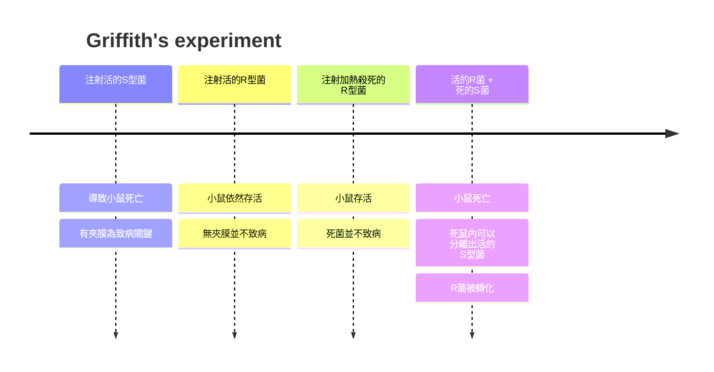
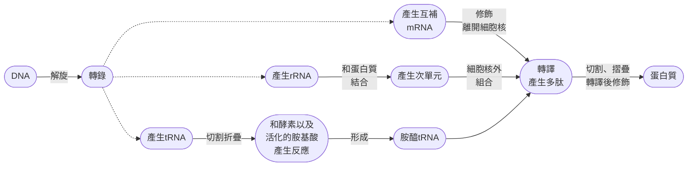
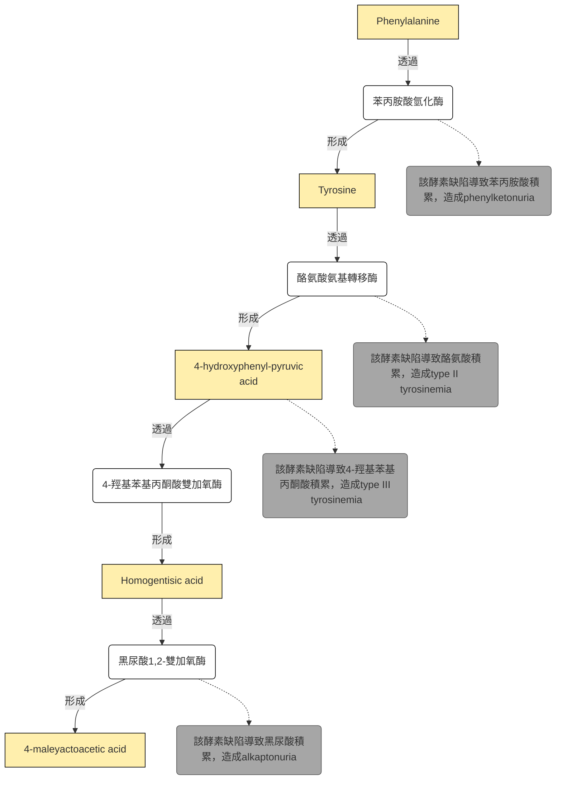

# molecular biology 1st
## chapter 1 and 2
### before we start the class...
> 大家還記得嗎? 😏
#### Mendel 🫛
- **Mendel並不知道gene的存在**，只是認為父母會給後代一些他也不知道的... 東西
- genotype = 基因型，phenotype = 表現型
- dominant = 顯性，recessive = 隱性，由於Mendel運氣好選到了完全顯性的物種性狀，因此才能夠提出分配律和獨立分離律
- 子代之所以用 $F$ 是因為拉丁文的*filius*是兒子，*filia*是女兒
- 他認為個體身上有兩個東西，每一次會各傳一個給自己的 $F$ ，homozygotes = 同型合子，heterozygotes = 異型合子
- 性狀會呈現出dominant allele的表現型，而且這些allele並不會消失，而是傳給下一代

#### Morgan 🪰
- chromosome theory of inheritance: 染色體是基因的載體
- 他把白眼 (recessive) 和紅眼 (dominant) 果蠅雜交，發現大部分 (但不是全部) 的第一子代是紅眼
- 然後第一代雄果蠅和第二代雌果蠅 (都是紅眼) 雜交，產生四分之一的白眼雄果蠅，沒有雌果蠅是白眼

> [!Tip]
> 這叫做sex-linked (性聯遺傳)，也是這時才把染色體分成autosome (體染色體) 和 sex chromosome (性染色體) 🐱

- wild type = standard type = 一般種，mutant = 突變種
- 白眼和短翅 (miniature) 都是mutant，也是X染色體性聯遺傳

##### 互換率
- 在雙雜合測交 (test cross) 或雜交實驗中，後代會分成親本型 (parental type) 和重組型 (recombinant type)
  - 親本型: 基因組合與親代相同
  - 重組型: 因為互換而出現的新組合

$$
\text{互換率} = \frac{\text{重組型個體數}}{\text{總個體數}} \times 100\%
$$

- 在基因圖譜中，常用分摩根 (centimorgan, cM)，**1% 的互換率 ≈ 1 cM**
- **互換率最高只能到 50%**，因為當基因座距離太遠時，互換幾乎隨機，和獨立分配無法區分
- **互換率與基因座距離大致成正比**，但在長距離上會低估 (因為可能有多次交叉互相抵消)

#### RNA類型


| RNA 種類 | 功能 | 負責的 RNA pol | 備註 |
| --- | --- | --- | --- |
| **mRNA** | 攜帶基因資訊，作為蛋白質合成模板 | **RNA pol II** | 轉錄大部分的 snRNA、miRNA 等 |
| **tRNA** | 將胺基酸帶到核糖體，對應 mRNA 密碼子 | **RNA pol III** | 同時也轉錄 5S rRNA 與一些小 RNA |
| **rRNA** | 構成核糖體的主要結構與催化成分 | **RNA pol I** | 專門轉錄 28S、18S、5.8S rRNA |


### 分子遺傳學
#### Griffith's experiment
- 發現了轉化原理，**transformation particle**
- 他使用 *Streptococcus pneumoniae*，分為有多醣莢膜的致病型 (S 型，smooth) 和無莢膜的非致病型 (R 型，Rough，很快就被白血球吞掉)

> [!Note]
> - **virulent**: 致命
> - **avirulent**: 不致命




#### Avery's experiment
- 雖然Griffith已經知道有一種東西可以把無害的細菌變成有害，但他不知道是啥物質
- 他一樣使用 *Streptococcus pneumoniae*，然後從S型細菌中提取未知的轉化物質
- 這些雜物分別用蛋白酶、RNA酶、DNA酶處理後，給R型菌

||觀察到|
|---|---|
|蛋白酶|R 型被轉化成 S 型|
|RNA酶|R 型被轉化成 S 型|
|DNA酶|R 型無法被轉化|

- 由於**唯有破壞 DNA 時，轉化作用消失**，這證明 DNA 就是遺傳物質，而不是蛋白質或 RNA


- 至於如何分離並確定是DNA，有一些方式...
  - 超快速離心 (Ultracentrifugation，很中二的名字)，因為DNA分子量很大
  - 電泳 (Electrophoresis)，因為他有很大的**charge-to-mass ratio**，跑很遠
  - 紫外光 (Ultraviolet)，在**260nm**有最大吸收峰 (不同於蛋白質的280nm)
  - 氮磷比 (N-to-P ratio)，通常DNA的磷很多，**如果高於1.67，代表可能還不夠純**

#### Beadle's experiment
- 他和Edward Tatum，例用麵包黴 (*Neurospora crassa*) 做實驗
- 一般來說麵包黴能在簡單培養基（只含糖、鹽、維生素）中生長，這代表它能自己合成所有必需胺基酸與維生素
- Beadle 與 Tatum 用 X 光 (mutagents) 照射孢子，製造隨機突變，然後讓他們在這些培養基中生長

> [!Tip]
> 若某突變株無法在最小培養基生長，但在加入特定胺基酸或維生素後能恢復生長，表示該突變破壞了合成該分子的基因 ! 😗

- 因此他們認為，每個基因控制一個特定酵素的合成，也就是**一基因一酵素假說**
- 但後來發現...
  - 一個酵素可以由多個基因形成
  - 很多基因並不編碼酵素，例如遺傳因子的基因
  - 有些基因甚至編碼RNA，而非蛋白質
  - 原核生物通常是一基因一多肽，但是真核生物有些可以做 "可變基因剪切"

#### Hershey–Chase experiment
- 利用phage T2，蛋白質外殼 + DNA核心
- 用 $^{35}S$ 標記蛋白質 (Cys and Met有S)， $^{32}P$ 標記DNA (磷酸基團)
- phage感染大腸桿菌後，把嗜菌體外殼甩掉
  - 如果是phage外殼被S標記，在離心後會在懸浮液裡面發現放射標記
  - 如果是phage DNA被P標記，在離心後會在沉澱pellet中發現放射標記 
- 因為pellet裡面是大腸桿菌，而在標記P的時候，才在pellet裡面發現標記，因此注入E.coli的東西，就是含有P的DNA


#### Meselson–Stahl experiment
- 他們用氮同位素 $^{15}N$ 培養E.coli，使其DNA全部含有重氮
- 然後轉移到只含 $^{14}N$ 的培養基，讓他們一代一代分裂
- 每一次複製後取出DNA，利用 $CsCl$ 做密度梯度離心 

|generation|result|
|---|---|
|第0代|只有重帶DNA|
|第1代|出現中間帶DNA|
|第2代|出現中間帶DNA和輕帶DNA|

- 這證明了半保留複製 **(semiconservative replication)**


### 聚核甘酸
- DNA的組成 = **含氮鹼基 + 磷酸基 + 去氧核醣**
- purine兩環，pyrimidine一環
- **核糖在2C上有OH**，去氧核糖沒有
- nucleosides為**核甘酸 - 磷酸基**
- 含氮鹼基連在1C，2C看是OH還是H，3C接磷酸二酯鍵 (phosphodiester bonds)，5C接磷酸基
- 起頭為5'-phosphate group，尾巴為3'-hydroxyl group

> [!Tip]
> 因為中間的鍵結是中間一個P，兩邊接O，所以叫做phospho + di + ester，如下: 
> ```
> Sugar₁ — O — P(=O)(O⁻) — O — Sugar₂
>          ↑               ↑
>        ester           ester
> ```


#### Chargaff's rules and double helix
- 嘌呤的數量大致和嘧啶差不多，$N_A = N_T,\ N_C = N_G$
- 富蘭克林等人製備一種濃度很高的DNA溶液，並且用針頭拉出一根纖維
- X射線繞射圖之所以很重要，就是因為呈現出來的圖型很簡單: 一系列呈現X型排列的斑點
- 如果是一般的蛋白質做繞射，這些斑點會像是亂槍掃射一樣隨便
> [!Important] 
> DNA如果分子量和蛋白質一樣很大，那唯一的解釋就是: 這個大分子有規則的重複結構 !! 🧐

- 唯一的悖論就是: 你說DNA是重複的規則，但是如果他有編碼蛋白質，那他的序列應該是不規則的啊
- 因此華克兩人提出一個解決矛盾的方法: 兩條DNA並排，並且嘌呤一定會和嘧啶配對 (寬度固定)
- 因此DNA的結構特色就是: 
   - 一圈大約十個鹼基對，一圈往上升高 $3.32nm$
   - 反平行，3'到5'，另一股就是5'到3'
   - 嘌呤和嘧啶之間氫鍵配對

### 核酸的特性
#### helix
- DNA有不同構相: A、B、Z
- B form是多數DNA的標準型，而**A form很常出現在雙股RNA或是DNA-RNA的雜合核酸**

|DNA型態|B-form|A-form|z-form|
|------|----|---|---|
|旋性|右手螺旋|右手螺旋|左手螺旋|
|一圈多少鹼基對|10.4 bp/turn|11 bp/turn|12 bp/turn|
|一圈有多高|3.4 nm/turn|2.4nm nm/form|4.5 nm/form|
|groove|明顯的 major and minor|有major and minor，但不明顯|只有一個groove|
|直徑|1.9 nm|2.3 nm (較寬)|1.8 nm (較扁)|
|屬於|標準型，predominant form，相對溼度約92%，鹼基和中心軸幾乎垂直|脫水型，鹼基相對於中心軸傾斜20度，結構較緊湊，相對溼度下降到75%|形成zig-zag的型態，通常出現在GCGCGC等重複序列裡面|


#### denature
- 雖然說嘌呤和嘧啶的量相似，但是**GC content**在各個生物中不一定一樣，從22%到73%都有，而這些差異會影響DNA的物理性質
- DNA加熱時會使中間氫鍵斷裂，形成兩條單股DNA，這又稱為denaturation
> [!Important]
> $T_m$ = DNA在denature一半時的環境溫度 🐱


- 在雙股 DNA 中，嘌呤與嘧啶鹼基彼此平行排列，形成 $\pi - \pi$ 堆疊。這種堆疊會限制電子的激發，降低紫外光 (最高吸收峰在 $260 nm$ ) 的吸收，產生 **"減色效應"**
- 當DNA加熱分開，H-bond消失，堆疊消失，吸收光的能力增加


- 偕同轉換: DNA denaturing並不是一個一個氫鍵斷裂，而是 "區塊脫落" (因為某一區域的氫鍵斷裂，會使鄰近區域更容易斷裂)
- 因此， $260nm$ 吸光度曲線會 "急遽上升"，呈現S型
- Tm值會隨著 $\frac{G+C}{A+T}$ 的比值升高而升高。所以越多GC，也就是GC content越高，DNA越穩定， $T_m$ 越高，因為氫鍵比較多，DNA比較難分開

#### 補充
- 加熱並非打開雙股的唯一方法，用dimethyl sulfoxide或是formamide (有機溶劑)，以及鹼性環境，都可以破壞氫鍵
- 降低環境鹽分也可以，因為沒有多餘的帶電粒子，兩條鏈上的負電荷就不太會被屏蔽，使DNA不用加熱太高溫就能夠分開
- DNA2的GC content也會影響DNA的密度，通常來說，GC content越高，密度越大，在用 $CsCl$ 做梯度的離心時就可以看出來

#### renature
- renature，或是annealing，就是DNA降溫後重新排列的情況
- 通常來說，會比 $T_m$ 低25度當renature的溫度，如果太高溫，那很有可能繼續分開，但是如果太低溫，單股分子移動速度變慢，又找不到彼此
> [!Tip]
> **quenching** = 把熱的DNA溶液插到碎冰裡面讓他們維持單股狀態 😗

- 除此之外，DNA溶液濃度越高，以及配對時間越長，renature的比例也會越高

#### hybrid
- 如果是ssDNA + ssRNA的結合，那不叫做renature，而是叫做**hybridization**

#### 大小測量
- DNA的大約分子量可以用長度轉換成鹼基對，鹼基對轉換成分子量，也就是說: 

$$
\begin{align}
N(\text{鹼基對}) & = \text{觀察長度}\times\frac{10.4\ \mathrm{\mathring{A}}}{33.2}\\
N(\text{分子量}) &= N(\text{鹼基對})\times 660
\end{align}
$$

- 因為一個鹼基對的平均分子量約為660
##### Metal shadowing
- DNA 是非常細的分子，非常接近電子顯微鏡的解析度極限，因此會用金屬鍍膜
- 概念就是... 
  - 將 DNA 分子鋪在薄膜上，再用重金屬 (如鉑、鈾、鎳) 噴霧撒他 (下雪的概念?)
  - 然後這些金屬沫就會堆積在DNA周圍，使DNA在暗色背景下發亮


- 這樣就有辦法在顯微鏡下估算DNA的長度了。除此之外，也可以用凝膠電泳來估算分子量

#### C-value paradox
- **C-value**就是每個 **"單倍體細胞"** 的基因組大小
- 不同生物的基因組大小差異極大，但這個大小卻**不一定與生物的複雜度相關**
- genome裡面有大量重複序列、轉座子、偽基因等，並不直接編碼蛋白質 (non-coding)
- 同時，複雜度更多來自基因調控網絡，而非基因數量。這種基因組大小跟生物複雜度不對齊的狀態，被稱為**C值悖論**


---

## chapter 3
### 訊息儲存
- 中心法則如下: 



- DNA在轉錄時，一個為template strand，一個是coding strand

#### 蛋白質結構
- 胺基酸由alpha-C為中心，一邊接 $NH_3^+$ ，一邊接 (COO^-)，一邊接 $H$ ，一邊接**R group**
- 胺基酸脫水後連接，以peptide bond相連，多肽分為N端和C端，沒有氫鍵時就是**primary structure**，有氫鍵做成 $\alpha$ -helix，或是 $\beta$ -sheet 時，就是**secondary structure**


> [!Note]
> $\beta$ -sheet有**平行**和**反平行**兩種形式，他們都存在 😗

- **tertiary structure**包含的鍵結很多樣，可以是**van de waal interaction**，也可以是**H-bond**，也可以是**covalent bond**，也可以是**ionic bond**

> GAMT (guanidinoacetate N-methyltransferase) 是creatine (肌酸) 合成的重要酵素，而肌酸在肌肉、心臟與腦中作為能量緩衝分子，透過磷酸肌酸系統快速再生 ATP，以 $\alpha$ -helix 和 $\beta$ -sheet 混合構成， $\beta$ -sheet呈現平行分布的構造 

<iframe src="https://Jacklyn301.github.io/molecular_model/3ORH_Human%20guanidinoacetate%20N-methyltransferase%20with%20SAH.html" width="100%" height="400px"></iframe>

- 蛋白質有時會分成不同區域，這又被稱為domain
- 這些domain有時可以看到叫做motifs的結構，例如所謂的鋅指就是其中一種
- 多數蛋白質並非有了自身序列就會自動摺疊，往往需要酵素以及合適的環境
- 但是蛋白質會因為胺基酸疏水或是親水的特性自動摺疊
- 通常來說，Leu、Val、Ile等疏水胺基酸會聚集在蛋白質中間的地方，避免靠近水

#### 遺傳和生化機制
- Archibald Garrod 在 1902 年首次提出**先天性代謝錯誤 inborn errors of metabolism**
- 他發現疾病 (例如研究**alkaptonuria**) 可以因為基因缺陷導致特定酵素缺失，進而影響代謝途徑
- 當時人們以應知道代謝是酵素參與，而它們發現這些代謝疾病似乎有遺傳傾向，因此開始認為gene和酵素有一定的關係



- 同時，劍橋科學家 William Bateson 指出alkaptonuria符合孟德爾的隱性遺傳模式，並進一步推動**遺傳學 (genetics)** 這一學科的建立
- 這個實驗和Beadle等人用麵包黴 (Neurospora crassa) 做出來的實驗假設類似

#### 基因分析
- 在基因分析上也做了一樣的事情。身為子囊菌的麵包黴，在形成2n的合子後會在減數分裂和細胞分裂後生成兩個8個子囊孢子
- 如果將突變的麵包黴和wild type 雜交，而同時該疾病是由單一的基因突變引起，那這8顆孢子，應該就有4顆是突變型
- 後來經過更深一步研究，從 "一酵素一基因" 假說，變成 "一多肽一基因" 假說

### 如何傳遞訊息?
- Crick發現說，DNA位於真核細胞的細胞核中，但是蛋白質往往是在細胞質中合成。所以一定有東西把DNA的訊息傳到了細胞質
- 他當時注意到了rRNA，但是又發現rRNA是核糖體不可分割的一部份，因此他認為: 

> [!Note]
> 一個細胞中有很多不同種核糖體，而rRNA攜帶特定的訊息，反覆合成同一個蛋白質 ! 🫠

- 當然，Jacob等人並不買帳，他們想要證明核糖體並不是訊息載體
- 他們先用 $^{15}N$ 和 $^{13}C$ 等較重的同位素培養細菌，讓這些細菌的核糖體逐漸含有這些標記的同位素
- 然後他們用phage感染細菌，並把細菌轉移到新的培養皿中，這些培養皿含有 $^{14}N$ 和 $^{12}C$，這導致接下來產生的任何新的核糖體都含輕同位素
- 同時利用 $^{32}P$ 標記未來產生的嗜菌體RNA。他們假設，如果Crick是正確的，那會發現只有新的核糖體蛋白質，可以和新的RNA形成核糖體

> [!Tip]
> #### 結果...
> - 後來在輕的核糖體上面 (也就是舊的核糖體)，看到了新合成的嗜菌體RNA
> - 也就是說，這些舊的RNA不僅不可能攜帶嗜菌體的遺傳信息，可能也根本不攜帶任何宿主的遺傳訊息
> - **核糖體從頭到尾基本上就是固定的！** 🧐

- 後來發現傳遞訊息的RNA，半衰期很短，並且與蛋白質合成同步
- 同時，這些短壽命 RNA 與 DNA 序列相對應，顯示它們是 "DNA 的抄本"，更進一步證明他們不是核糖體的固定成分
- 這後來被稱為mRNA

#### 轉錄
- 通常分為三個階段: 起始、延伸、中止

|phase|description|
|---|---|
|**Initiation**|酵素辨識promoter (位於基因上游)，pol會在promoter結合，打開雙股螺旋 (約分開12個bp)，然後用NTP建造 |
|**Elongation**|合成時為**RNA本身的5'到3'方向**，轉錄泡隨著RNA pol移動，轉錄完的上游區域會重新變成雙股螺旋，一次一條RNA，一次只拿一股DNA當模板|
|**Termination**|基因末端往往有terminator，會發出終止訊號，並和RNA pol相互作用，使RNA從DNA和RNA pol分離|

- 通常轉錄開始時，RNA 第一個 nucleotide 常常是ATP或是GTP，RNA的5' 保留pppA或是pppG，因為它是 de novo synthesis，沒有 primer。

> [!Important]
> ##### Most initiations are abortive
> - RNA polymerase 剛開始其實超廢。它常常：
> ```text
> 做2個核苷酸
> ↓
> 失敗 🧐
>
> 做4個核苷酸
> ↓
> 失敗 🙂
>
> 做7個核苷酸
> ↓
> 失敗 💀
> ```
> - RNA常常做一半就掉出去，重新開始，這叫做**abortive initiation**，產生小 RNA。

- 當做到 8~10 nt的時候，這時候 RNA polymerase開始離開 promoter，開始進入穩定 elongation

#### ribosome
- E.coli的兩個單元大概是30S和50S (沉降係數，離心時辰降到管底的速度)，兩個形成70S的核糖體
  - **small subunit** = 16S rRNA + 21個蛋白質
  - **large subunit** = 23S rRNA + 5S rRNA + 34個蛋白質
- rRNA生存的唯一目的就是變成核糖體，參與催化功能，並不編碼蛋白質

> [!Warning]
> 沉降係數和顆粒質量不成正比，通常來說，關係大致如下: 
> $$\text{沉降係數}\propto(\text{質量})^{\frac{2}{3}}$$

#### tRNA
- Crick當時想知道到底是什麼東西讓RNA的訊息變成蛋白質的，畢竟還沒甚麼相關的數據和研究
- 他只知道這個分子應該要能辨認RNA，也可以辨認特定的氨基酸。很幸運的是，他的猜測似乎對了 🐱
- tRNA被摺疊成L型三級結構，有兩個功能端，一端就是tRNA的3'，也負責連接胺基酸。另一端是反密碼子區域，可以跟mRNA做互補


<iframe src="https://Jacklyn301.github.io/molecular_model/1EHZ_the%20crystal%20structure%20of%20yeast%20phenylalanine%20tRNA.html" width="100%" height="400px"></iframe>

- 相應的tRNA具體要配對的氨基酸往往是固定的 (不模糊性)，如果該tRNA對應到的氨基酸是alanine，那酵素只能讓alanine何其結合
- 這種酵素通稱為aminoacyl-tRNA synthetase


<iframe src="https://Jacklyn301.github.io/molecular_model/1G59_Glutamyl-tRNA%20synthetase%20complex%20with%20tRNA(Glu).html" width="100%" height="400px"></iframe>


| 特徵     | 解釋  |
| ----| ---- |
| degeneracy/redundancy<br>退化性 | 多個密碼子對應同一種胺基酸|
| unambiguous<br>不模糊性| 特定一種密碼子只對應一種胺基酸 |
| universal<br>廣泛性 | 所有生物共用同一套遺傳密碼，雖然偶有差異 |

#### 轉錄的起始
- translation開頭的codon為AUG
- **Shine-Dalgarno 序列**是細菌 mRNA 上的一段短序列，在AUG上游
- 這些序列不完全是固定的，但是共識序列通常是 `AGGAGG`。它會**和 16S rRNA 的 3′ 端互補配對**

> [!Tip]
> 真核生物沒有Shine-Dalgarno 序列，而是由elF4E蛋白和5'帽結合，吸引核糖體

#### 延伸
- 順序為**A、P、E**
- 起始tRNA在P位點結合，然後延伸的工作在A位點完成
- **peptidyl transferases**負責連接A位點的胺基酸到P位點
- 轉移的過程需要**EF-Tu蛋白和GTP**
- 轉位發生，核糖體往前移一個 codon，**A → P，P → E** 
- tRNA離開核糖體需要**EF-G蛋白和GTP**

|site|description|
|---|---|
|**A 位 (aminoacyl-tRNA)**|新 aminoacyl-tRNA 進入|
|**P 位 (peptidyltRNA)**| 帶有生長中的多肽鏈的 tRNA|
|**E 位 (exit)**|釋放已經卸下胺基酸的 tRNA|


#### 終止
- 當遇到終止密碼子 (UAA, UAG, UGA)，沒有對應的 tRNA
- 釋放因子結合上去，促使多肽鏈釋放
- **RF3** (原核) 會幫助釋放因子離開核糖體，也要靠 **GTP**


- ORF (open reading frame) = DNA從起始密碼子到終止密碼子這一段
- 一般來說，一條mRNA可能ORF會有很多個，畢竟你可能可以在一條序列中找到多個起始密碼子和終止密碼子，例如...

```text
5' ───────────────────────────────────── 3' mRNA
      AUG───────UAA                         可能1
          AUG──────────────UGA              可能2
             AUG───UAG                      可能3
```

- 但是對典型的 eukaryotic mRNA，ribosome 通常會**從 5′ cap 附近開始 scanning**，找到合適的 start codon 後開始翻譯
- 因此，如果有一個主要的、較長的 coding region，它就很可能是主要 protein-coding ORF

#### mRNA區域
- 通常長這個樣子: 

$$
\boxed{\text{5'-UTR, leader}}-\boxed{\text{coding region}}-\boxed{\text{3'UTR, trailer}}
$$

- coding region對應到的就是DNA的ORF
- 其中，起始密碼子和終止密碼子都是包含於coding region

### 複製和突變
#### replication
- Crick等人在發表論文時，就已經有預測DNA應該會複製，以將訊息傳給子細胞
- 而它們也預測DNA是透過**semiconservative replication**
- 當然，當時還有其他假設，例如conservative (全保留)、dispersive (分散式)
- 而透過Meselson–Stahl experiment，確定了DNA是半保留複製

#### 無害的突變
- 通常無害的點突變分為兩種: 
   - **silent mutation**: 突變後的codon對應突變前的同一個胺基酸，例如 `AAA` = `AAG` = Lysine
   - **conservative**: 突變後的codon對應突變前codon的胺基酸性質類似，例如 `CUC` = Leucine，`AUC` = Isoleucine，Leu和Ile皆為hydrophobic，蛋白質摺疊時比較不會出問題

#### sickle cell disease
- 一般人的RBC呈現biconcave disc (雙凹圓盤狀)
- 對於同型合子的病患來說，**氧氣充足的情況下，RBC可以維持正常形狀**，但是一旦運動或是氧含量下降，就會變成crescent (新月形)
- 這些血球無法通過capillaries，因此會阻塞、撕破血管壁
- 這主要是因為血球的hemoglobin在氧含量下降時，原本融於水的他們會聚集，形成長纖維

#### 如何驗證
- 利用蛋白質定序得出的。順序大概是: 
  - $\beta$ -globin利用酵素切斷特定肽鍵，形成多段peptides
  - 然後這坨混合物先電泳拉開距離
  - 然後把載體 (紙) 轉90度，再電泳一次，從另一個方向把多肽們拉開
  - 這些多肽會像點一樣散步在紙上，而不同蛋白質，點分布的情形就會不一樣

> [!Note]
> 這就幾乎相當於這種蛋白質的 fingerprint ! 😏


- 所以如果去看看HbA (正常 $\beta$ 球蛋白)，以及HbS (不正常 $\beta$ 球蛋白)，圖譜上就會有差異

#### 序列


- 點突變導致原本正常序列的Glutamate變成Valine，前者帶電，親水性；後者偏向疏水性
